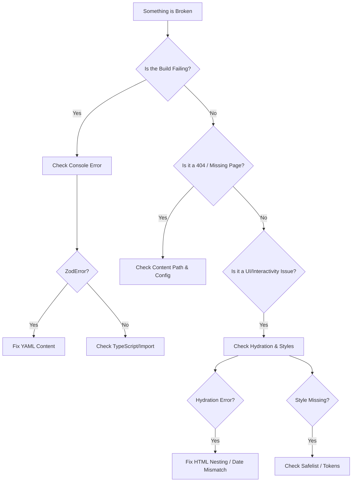

# Protocol: Debugging Flowchart

**Status:** Active Protocol
**Scope:** Build Errors, Runtime Crashes, "Ghost" Content
**Tools:** Terminal, Browser DevTools, `npm run context:refresh`

## 1. The "Emergency Reset" (Try This First)

Before diving deep, ensure the environment isn't stale. Astrical uses aggressive caching (Vite + Astro + Content Layer).

**The "Turn it off and on again" Protocol:**
1.  Stop the dev server (`Ctrl+C`).
2.  Run the cleaning command:
    ```bash
    rm -rf node_modules/.vite .astro dist
    ```
3.  Refresh the Context (Important for AI Agents):
    ```bash
    npm run context:refresh
    ```
4.  Restart:
    ```bash
    npm run dev
    ```

---

## 2. The Decision Tree (Visual Guide)




---

## 3. Scenario A: Build Failures ("The Red Text")

**Symptom:** You run `npm run dev` and it crashes immediately.

### Case 1: The "Zod Validation" Error

**Message:** `ZodError: Invalid input` or `Expected string, received number`
**Diagnosis:** You edited a YAML file in `content/`, and it violates the schema defined in `src/types/page.ts`.
**Fix:**

1. Look at the error path (e.g., `content/pages/about.yaml`).
2. Compare keys against `03_content_ops/content.spec.yaml`.
3. *Common Mistake:* Using a number for a string field, or missing a required `id`.

### Case 2: The "Module Not Found"

**Message:** `Cannot find package 'astrical-module-xyz'` or `Import not found`
**Diagnosis:**

1. You are importing a module that isn't installed.
2. You are trying to import a *Core* file from a *Module* (Circular Dependency).
**Fix:**

* Run `npm install`.
* Check `dev/00_context/current_state.md` to see if the module is actually recognized by the system.

---

## 4. Scenario B: Ghost Content ("The 404")

**Symptom:** You created `content/pages/new-feature.yaml`, but visiting `/new-feature` gives a 404.

### Checklist:

1. **The "Index" Trap:**
* Did you name it `content/pages/feature/index.yaml`?  URL is `/feature/`.
* Did you name it `content/pages/feature.yaml`?  URL is `/feature`.
* *Fix:* Ensure the filename matches your expected URL structure.


2. **The "Draft" Status:**
* Check the metadata in the YAML: `draft: true`?
* *Fix:* Set `draft: false` or remove the key.


3. **The Catch-All Route:**
* Does `src/pages/[...build].astro` exist? (It should).
* If you accidentally deleted it, NO dynamic pages will work.


---

## 5. Scenario C: Hydration Nightmares ("The UI Glitch")

**Symptom:** The page loads, but the layout shifts, buttons don't work, or the console says `Hydration mismatch`.

### Case 1: The "Illegal Nesting"

**Message:** `Hydration failed because the initial UI does not match what was rendered on the server.`
**Diagnosis:** You put invalid HTML inside an Island.
**Common Violations:**

* `<p><div>...</div></p>` (Block inside Inline).
* `<a><button>...</button></a>` (Interactive inside Interactive).
**Fix:**
* Change the outer tag to `<div>` or `<span>`.
* Use the "Debug Border" technique to find the offending element.

### Case 2: The "Time Traveler"

**Diagnosis:** Server renders `12:00 PM` (UTC), Client renders `8:00 AM` (Local). The text differs, causing React to freak out.
**Fix:**

* Use a `<ClientOnly />` wrapper.
* Or force a consistent timezone string in the prop.

---

## 6. Scenario D: Styling Issues ("Why is it ugly?")

**Symptom:** You added `bg-red-500` but the element is transparent.

### Case 1: The "Dynamic Class" Trap

**Bad Code:** `<div class={`bg-${color}-500`}>`
**Diagnosis:** Tailwind scans your files for *complete strings*. It cannot see `bg-red-500` if you construct it dynamically at runtime. It purges the class from the CSS bundle.
**Fix:**

* **Option A:** Safelist the class in `tailwind.config.mjs`.
* **Option B (Preferred):** Map props to full strings.
```tsx
const colors = { red: 'bg-red-500', blue: 'bg-blue-500' };
<div class={colors[props.color]}>

```


### Case 2: The "Token" Typo

**Bad Code:** `text-primary-500`
**Diagnosis:** Our Design System uses Semantic Tokens (`text-primary`), not the numeric scale (`-500`) for brand colors.
**Fix:** Check `dev/04_design_system/tokens.md`. Use `text-primary` or `text-primary/80`.

---

## 7. Scenario E: Logic Failures ("It clicked but nothing happened")

**Symptom:** Form submits but no email is sent.

### Case 1: The Registry Miss

**Diagnosis:** You added `handlers: [ 'my-new-handler' ]` to config, but didn't create the class.
**Fix:**

1. Check `src/form-handlers/`.
2. Does the class have `name = 'my-new-handler'`?
3. Did you restart the dev server? (New files sometimes require a restart to be globbed).

### Case 2: The Silent Crash

**Diagnosis:** The handler threw an error, but the `try/catch` in the API route swallowed it.
**Fix:**

* Check the Server Console (Terminal), not the Browser Console.
* Add `console.log('STEP 1')` debugging inside your Handler's `handle()` method.

---

## 8. Summary Checklist for Agents

When stuck, the AI Agent must follow this loop:

1. **READ** `dev/00_context/current_state.md` to ensure you know the file paths.
2. **CHECK** the Terminal for Zod/Build errors.
3. **VERIFY** the Route exists in `content/pages/`.
4. **INSPECT** the Browser Console for Hydration errors.
5. **RESET** using `npm run context:refresh` if hallucinating files.
